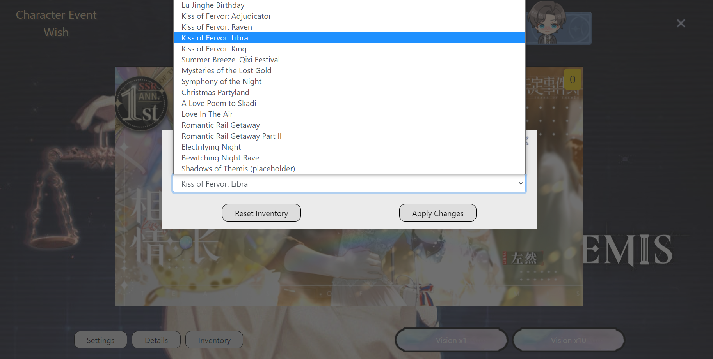

# Tears of Themis Simulator
A React web application to simulate Tears of Themis gacha based off the better made
and more popular Genshin Impact gacha react app.

## Disclaimer

<p>
  This simulator was only created for Karen's birthday because she couldn't pull who she wanted to.
</p>
<p>
  I am not affiliated with Mihoyo, all assets in this application were taken from third party websites and some screenshotted from the game itself.
</p>
<p>
  All product names, logos, and brands are property of their respective owners in the United States and/or other countries.
</p>

#### Assets From
https://www.nxxtoolbox.com/home
https://tiramisiyu.tumblr.com/
https://docs.google.com/spreadsheets/d/1no7RCQOaUaDMnOoIqWroQ3eqWG1WQlcVeElMXKhbf24/edit?usp=drivesdk


## Technologies Used
- React (best js framework)
- Webpack (module bundler)
- Babel (compiling ES6 and JSX)
- Bootstrap 4 (design)
- Mocha (testing)
- Chai (testing and asserting)
- Cypress (testing)

## Live

Eventually


## Preview

- Background
  <p align="center">
    
  </p>

  - Banners
    <p align="center">
      
    </p>  

    - Banner List
      <p align="center">
        
      </p>  

- Details
  <p align="center">
    
  </p>

- Variable Animation depending on Rarity
  <p align="center">
    
  </p>

  - Gacha Results
    <p align="center">
      
    </p>  

    - Gacha Results (Single)
      <p align="center">
        
      </p>  


- Inventory
  <p align="center">
    
  </p>

## Features

- User can pull for their favorite cards
- User can view banners
- User can switch banners
- User can view inventory
- User can reset inventory
- User can filter between male leads, rarity, and argument type in inventory
- User can see estimated money spent in USD ($2.77 per pull assuming $100 for 6480 S Chips)
- User can see wish animation before seeing pulls (regular tear drop for R/SR diamond tear for SSR)
- User can skip animation
- User's inventory persists in local storage

### Future Features

- Maybe for Cathy's birthday I will add user stories and voiced SR cards

## Development

#### System Requirements

- NPM 6 or higher
- Node 10 or higher (LTS not version 17 latest release)
- Other libraries may be needed for future versions (I will update then)

### Installing Node

- Follow the install guide: https://docs.npmjs.com/downloading-and-installing-node-js-and-npm/
- I highly recommend using a package manager (I use chocolatey for windows)
- Steps I followed:
  ```shell
  @"%SystemRoot%\System32\WindowsPowerShell\v1.0\powershell.exe" -NoProfile -InputFormat None -ExecutionPolicy Bypass -Command "[System.Net.ServicePointManager]::SecurityProtocol = 3072; iex ((New-Object System.Net.WebClient).DownloadString('https://community.chocolatey.org/install.ps1'))" && SET "PATH=%PATH%;%ALLUSERSPROFILE%\chocolatey\bin"
  ```
- After choco is installed, install a version manager for node (I used nodist)

  ```shell
  choco install nodist
  ```
- Then install nodejs with nodist using
  ```shell
  npm install -g npm
  ```
- Make sure you have git you can install from the website or just
  ```shell
  choco install git
  ```

#### Getting Started

1. Clone the repository.

    ```shell
    git clone https://github.com/HKrishna31415/tears-of-themis.git
    cd tears-of-themis
    ```

1. Install all dependencies with NPM.

    ```shell
    npm install
    ```

1. Confirm application is working appropriately

    ```shell
    npm run test
    ```

    **For some operating systems using wsl may not be able to run the full test script and may need to run them individually. If that is the case run the following commands below.**

    Development server
    ```shell
    npm start
    ```

    Unit tests
    ```shell
    npm run test:mocha
    ```

    Integration tests
    ```shell
    npm run cypress
    ```

1. Run the webpack development server.

    ```shell
    npm start
    ```

1. Once started you can view the application by opening http://localhost:3000 in your browser.

#### Testing

1. Any banner added or modified will require additions to the unit and integration tests.  Please check the `test/` and `cypress/` directories.

1. Run tests

    ```shell
    npm run test
    ```
## Adding New Banners

Each banner needs new banner assets, new data models, and new data sources in JSON format. All formatting must
match existing formatting. E.g. inventory.ml looks at the ml property (short for male lead) in the JSON data source. Not having one available will cause a crash.
